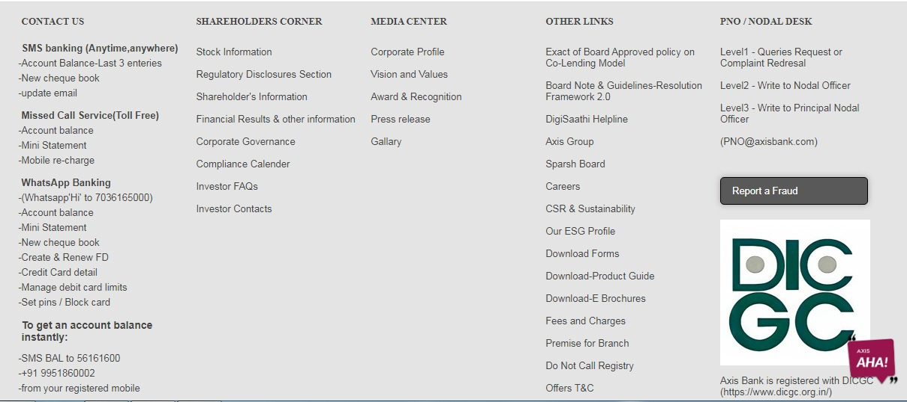
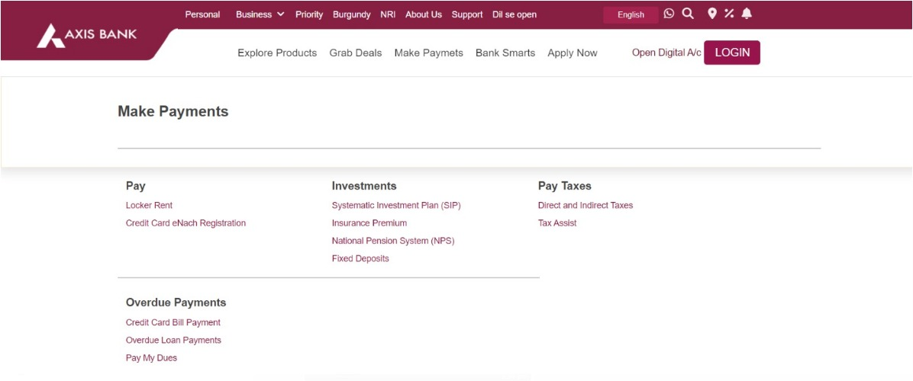
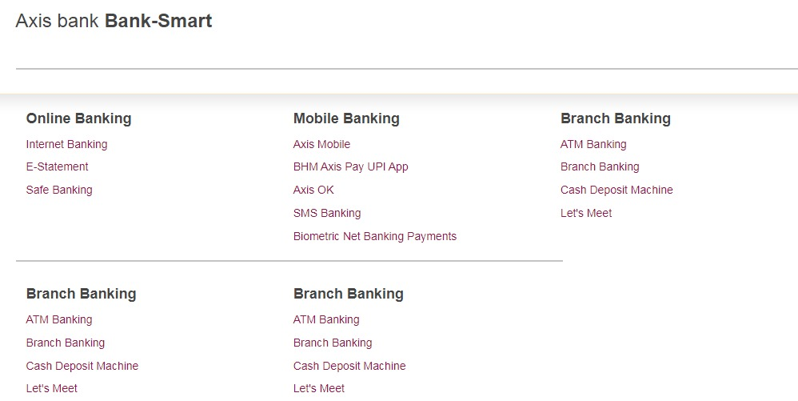

# Project Name -- Axis Bank

## Mayank ratnakar

My Name is Mayank Ratnakar , I am from fs15 batch , I got a Axix bank project ,where we have been assigned with a different task so
"I am tasked with creating three essential pages for the Axis Bank UI project:  
Semantic Tags used while creating this poject:

header: Represents the header of the document or a section.
nav: Defines a container for navigation links.
main: Represents the main content of the document.
article: Represents an article or a piece of content that can be distributed and reused.
section: Defines a section of the document.
aside: Represents content that is tangentially related to the content around it.
footer: Represents the footer of the document or a section.
iframe: Embeds an inline frame, often used for including external content.

 Non-Semantic Tags: 

- div: A generic container used for grouping and applying styles to sections of content. 
- span: A generic inline container often used for applying styles to a specific portion of text. 
- a: Represents hyperlinks. 
- img: Embeds images. 
- p: Represents a paragraph of text. 
- ul, ol, li: Used for creating unordered and ordered lists. 

# External Packages/Frameworks Used

- Owl Carousel: Our project features the Owl Carousel library for creating dynamic and interactive image carousels. This library enhances the user experience by providing a seamless way to navigate through featured content.

- FontAwesome: We enriched our user interface by integrating FontAwesome icons, adding a visually appealing and consistent iconography to our project.

- Google Fonts: To enhance the typography and overall aesthetic, we integrated Google Fonts, ensuring a visually pleasing and readable text across the website.
# First page -- Axis bank footer

# description: 

In the creation of this webpage, I employed the power of the CSS position property to meticulously arrange images and text elements. The position property allows me to precisely control the placement of each element on the page, ensuring a visually appealing and structured layout. By strategically applying values such as "relative," "absolute," or "fixed" to the position property, I can seamlessly position images alongside text, creating a harmonious design that enhances the overall user experience. This approach grants me the flexibility to finely tune the visual presentation, resulting in a polished and well-organized webpage.

# Second page -- Makepayment

# description: 

In crafting this webpage, I opted for the dynamic features of the Owl Carousel instead of relying on Bootstrap. By harnessing the flexibility of the Owl Carousel plugin through HTML and CSS, I could intricately arrange images and text elements with finesse. The Owl Carousel facilitates a seamless and interactive display, allowing for a smooth transition between different elements. Leveraging the customizable options of the Owl Carousel, I achieved a visually appealing and engaging layout that enhances the overall user experience. This approach, centered around the Owl Carousel, provides a modern and efficient alternative to traditional Bootstrap frameworks, ensuring a polished and captivating webpage design.

# Third page -- BankMsart

# description: 

In the construction of this webpage, I embraced the versatility of flexbox and the unordered list (ul) element in HTML and CSS. Utilizing flexbox, I efficiently arranged and aligned elements, fostering a responsive and flexible layout that adapts seamlessly to different screen sizes. The ul element, in conjunction with CSS styling, allowed me to organize content in a structured list format, enhancing readability and visual coherence. This combination of flexbox and ul empowers me to create a well-structured and aesthetically pleasing webpage, providing a foundation for a user-friendly and visually appealing design.