# Project Name -- Axis Bank

## Shubham Chopde

My Name is Shubham Chopde , I am from fs15 batch , I got a Axix bank project ,where we have been assigned with a different task so

"I am tasked with creating three essential pages for the Axis Bank UI project:  
<!-- an 'Dil se Open' page, a 'Explore' page, and an 'Grab Deal' page. The 'Apply Now' page involves designing an intuitive form for users to submit applications seamlessly. The 'Priority' page focuses on highlighting exclusive benefits for Priority customers, outlining the application process, and detailing membership perks. Finally, the 'NRI' page aims to provide NRIs with a comprehensive overview of banking services, account opening processes, currency exchange details, and dedicated customer support information. The goal is to deliver a user-friendly and visually appealing interface for each of these pages. -->

Semantic Tags used while creating this poject:

header: Represents the header of the document or a section.
nav: Defines a container for navigation links.
main: Represents the main content of the document.
article: Represents an article or a piece of content that can be distributed and reused.
section: Defines a section of the document.
aside: Represents content that is tangentially related to the content around it.
footer: Represents the footer of the document or a section.
iframe: Embeds an inline frame, often used for including external content.

 Non-Semantic Tags: 

- div: A generic container used for grouping and applying styles to sections of content. 
- span: A generic inline container often used for applying styles to a specific portion of text. 
- a: Represents hyperlinks. 
- img: Embeds images. 
- p: Represents a paragraph of text. 
- ul, ol, li: Used for creating unordered and ordered lists. 

# External Packages/Frameworks Used

- **Owl Carousel:** Our project features the Owl Carousel library for creating dynamic and interactive image carousels. This library enhances the user experience by providing a seamless way to navigate through featured content.

- **FontAwesome:** We enriched our user interface by integrating FontAwesome icons, adding a visually appealing and consistent iconography to our project.

- **Google Fonts:** To enhance the typography and overall aesthetic, we integrated Google Fonts, ensuring a visually pleasing and readable text across the website.

# First page -- DIL SE OPEN 
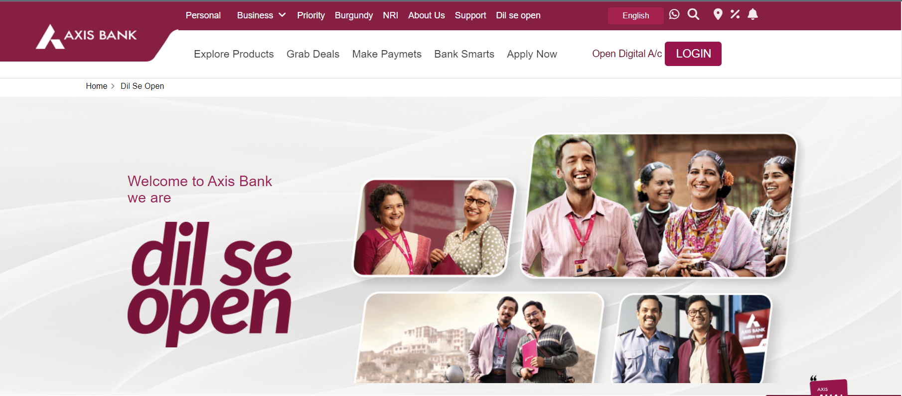
# description: 
In the creation of this webpage, I employed the power of the CSS position property to meticulously arrange images and text elements. The position property allows me to precisely control the placement of each element on the page, ensuring a visually appealing and structured layout. By strategically applying values such as "relative," "absolute," or "fixed" to the position property, I can seamlessly position images alongside text, creating a harmonious design that enhances the overall user experience. This approach grants me the flexibility to finely tune the visual presentation, resulting in a polished and well-organized webpage.

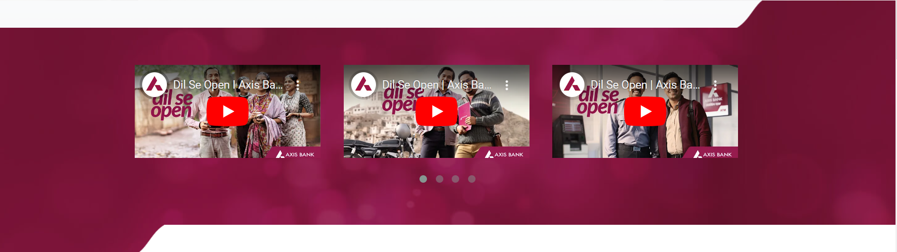
# description: 

In crafting this webpage, I opted for the dynamic features of the Owl Carousel instead of relying on Bootstrap. By harnessing the flexibility of the Owl Carousel plugin through HTML and CSS, I could intricately arrange images and text elements with finesse. The Owl Carousel facilitates a seamless and interactive display, allowing for a smooth transition between different elements. Leveraging the customizable options of the Owl Carousel, I achieved a visually appealing and engaging layout that enhances the overall user experience. This approach, centered around the Owl Carousel, provides a modern and efficient alternative to traditional Bootstrap frameworks, ensuring a polished and captivating webpage design.

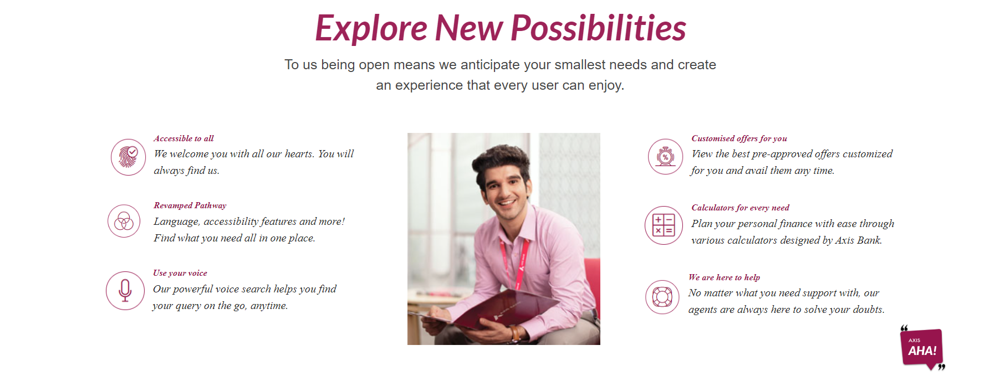
# description: 

In the construction of this webpage, I embraced the versatility of flexbox and the unordered list (ul) element in HTML and CSS. Utilizing flexbox, I efficiently arranged and aligned elements, fostering a responsive and flexible layout that adapts seamlessly to different screen sizes. The ul element, in conjunction with CSS styling, allowed me to organize content in a structured list format, enhancing readability and visual coherence. This combination of flexbox and ul empowers me to create a well-structured and aesthetically pleasing webpage, providing a foundation for a user-friendly and visually appealing design.

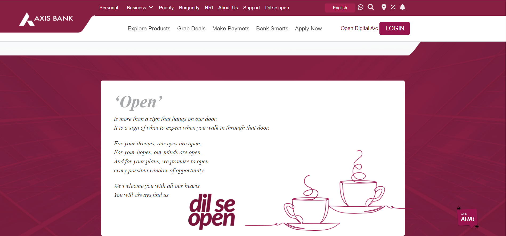
# description: 

In the development of this page, I harnessed the power of the CSS position property to meticulously control the placement of elements. Employing values such as "relative," "absolute," or "fixed," I precisely positioned images and text, sculpting a visually pleasing layout. The position property's strategic application allowed for a customized arrangement, providing a foundation for a polished and well-organized webpage design. This approach, rooted in the thoughtful use of position properties, ensures a visually appealing and structured presentation, contributing to an enhanced user experience.

# second page -- EXPLORE
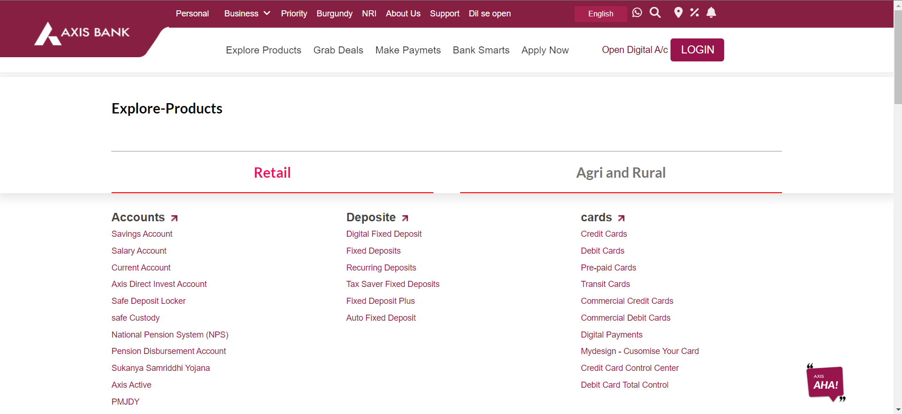
# description: 
I have used flex property of CSS for best row wise division ,and border right property for adjsting the vertical line after each division.At the right Bottom i have used a chat Box for this is have use js it will giv us a alert messsege for which message which we have send.

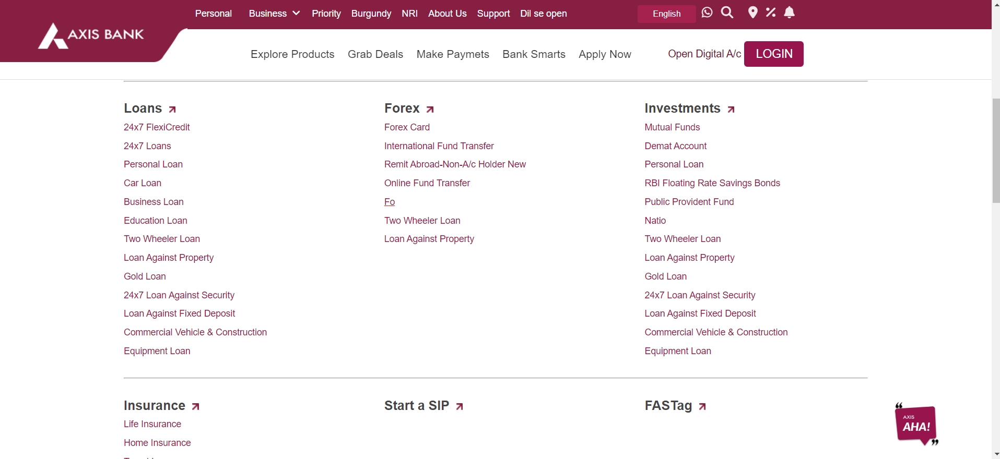
# description: 
I have used flex property of CSS for best row wise division ,and border right property for adjsting the vertical line after each division.At the right Bottom i have used a chat Box for this is have use js it will giv us a alert messsege for which message which we have send.

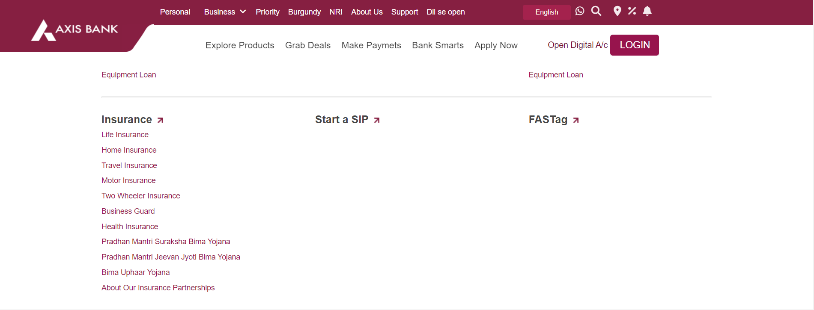
# description: 
I have used flex property of CSS for best row wise division ,and border right property for adjsting the vertical line after each division.At the right Bottom i have used a chat Box for this is have use js it will giv us a alert messsege for which message which we have send.

# Third page -- GRAB DEALS
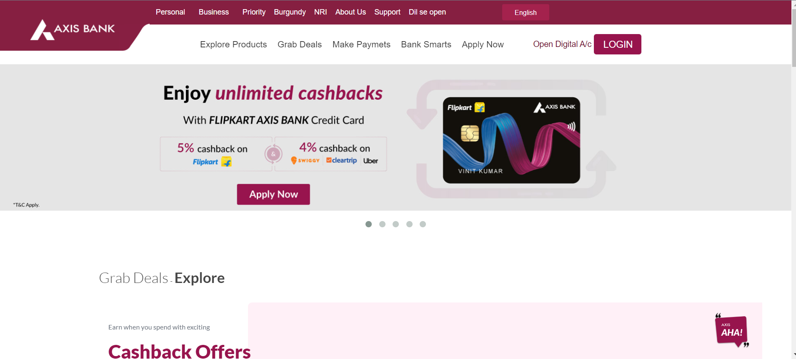
# description: 

In crafting this webpage, I opted for the dynamic features of the Owl Carousel instead of relying on Bootstrap. By harnessing the flexibility of the Owl Carousel plugin through HTML and CSS, I could intricately arrange images and text elements with finesse. The Owl Carousel facilitates a seamless and interactive display, allowing for a smooth transition between different elements. Leveraging the customizable options of the Owl Carousel, I achieved a visually appealing and engaging layout that enhances the overall user experience. This approach, centered around the Owl Carousel, provides a modern and efficient alternative to traditional Bootstrap frameworks, ensuring a polished and captivating webpage design.

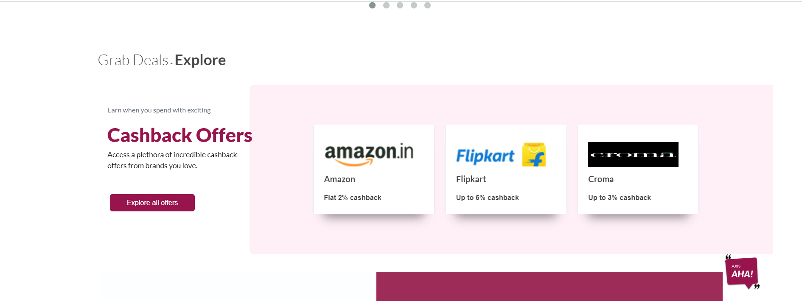
# description: 
In the design of our page, we've employed a strategic combination of CSS techniques to enhance both aesthetics and functionality. Leveraging the position: absolute property, we've precisely positioned certain elements, ensuring a clean and organized layout. The flex property, on the other hand, has empowered us to create a flexible and responsive structure, seamlessly adapting to various screen sizes. To elevate the user experience, we've incorporated subtle animations, bringing a dynamic touch to key interactions and transitions. This thoughtful integration of position: absolute, flex, and animations collectively contributes to a visually engaging and user-friendly NRI page, aligning with our commitment to delivering a modern and polished interface.
 

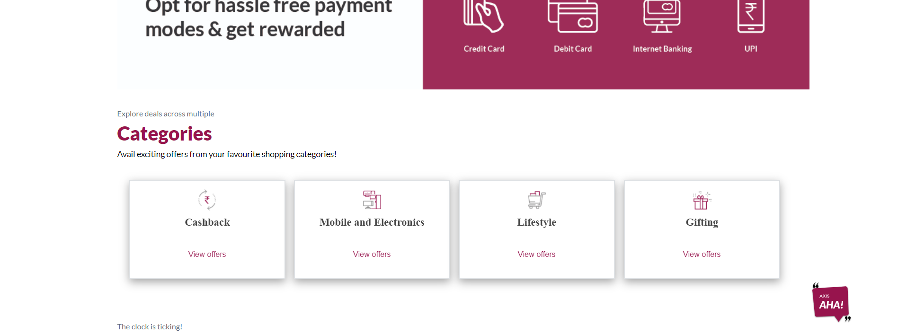
# description: 
In the design of our page, we've employed a strategic combination of CSS techniques to enhance both aesthetics and functionality. Leveraging the position: absolute property, we've precisely positioned certain elements, ensuring a clean and organized layout. The flex property, on the other hand, has empowered us to create a flexible and responsive structure, seamlessly adapting to various screen sizes. To elevate the user experience, we've incorporated subtle animations, bringing a dynamic touch to key interactions and transitions. This thoughtful integration of position: absolute, flex, and animations collectively contributes to a visually engaging and user-friendly NRI page, aligning with our commitment to delivering a modern and polished interface.
 

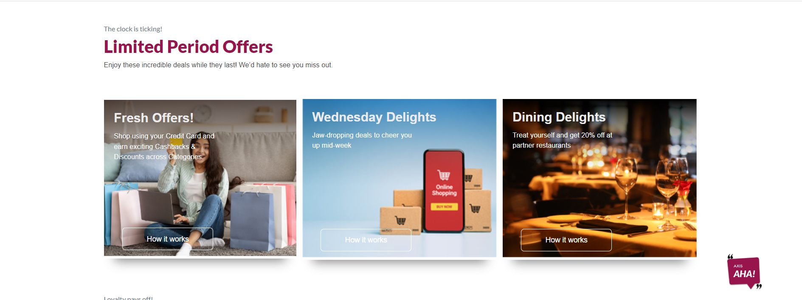
# description: 
In crafting this webpage, I strategically combined the capabilities of both the CSS position property and flexbox. Leveraging the position property, I fine-tuned the precise placement of elements, while flexbox provided a dynamic and responsive layout. By utilizing flex containers and items, I achieved seamless alignment and distribution of content, ensuring optimal visual balance across various screen sizes. This dual approach, blending the control offered by position properties with the flexibility of flexbox, allowed for a harmonious and visually engaging webpage design. The combination of these CSS features provides a robust foundation for creating an aesthetically pleasing and functionally responsive user interface.

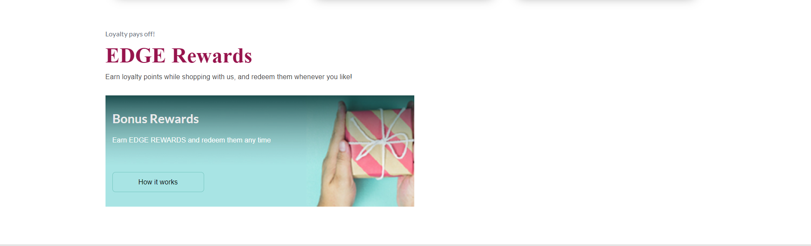
# description: 
In the development of this webpage, I employed a range of fundamental CSS properties to style and structure the content. Properties such as color, font-size, margin, padding, and border allowed me to define the visual aspects of elements. I utilized width and height to control dimensions, while text-align and line-height ensured proper text presentation. The display property, alongside block and inline, governed the layout structure, and the use of background and box-shadow contributed to the overall visual aesthetics. Through a thoughtful combination of these normal CSS properties, I crafted a cohesive and visually appealing design for an enriched user experience on the webpage.
