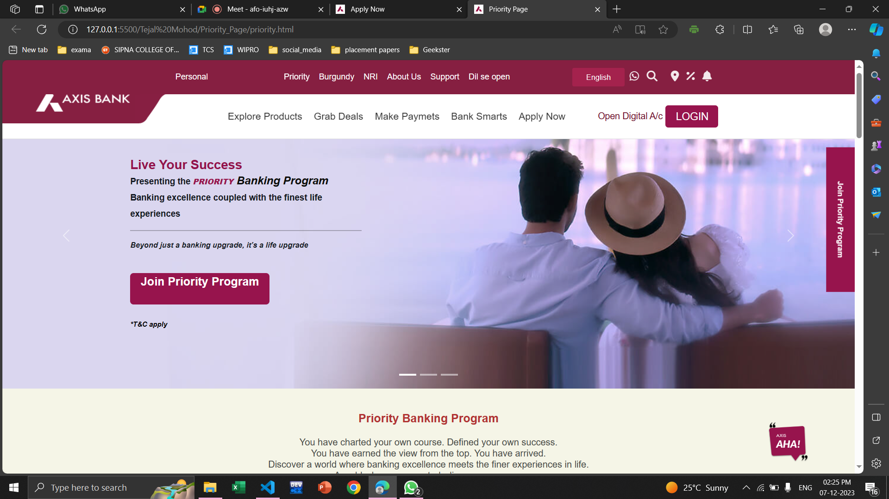
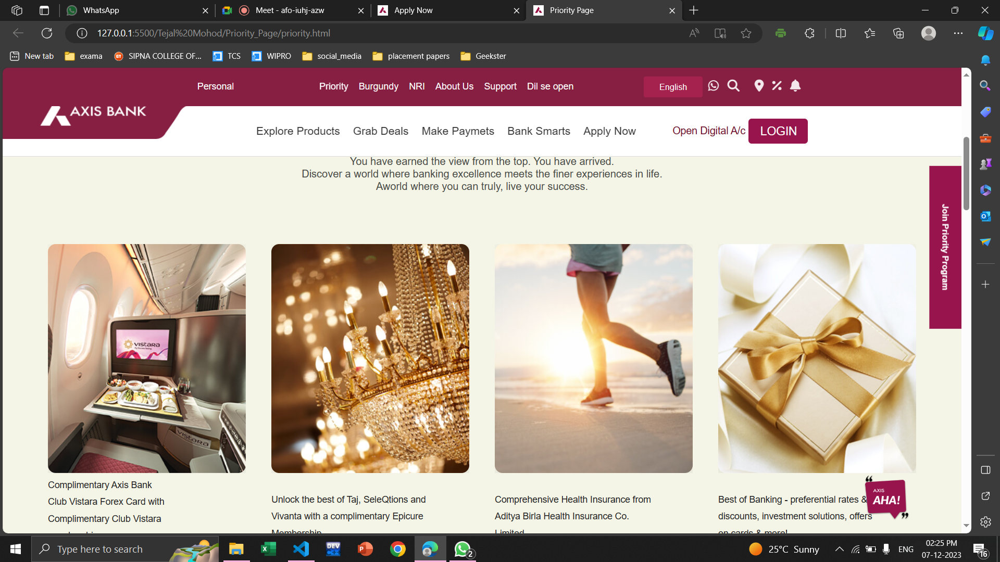
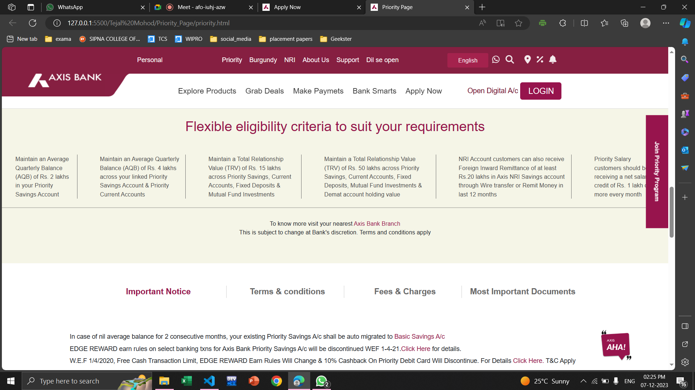
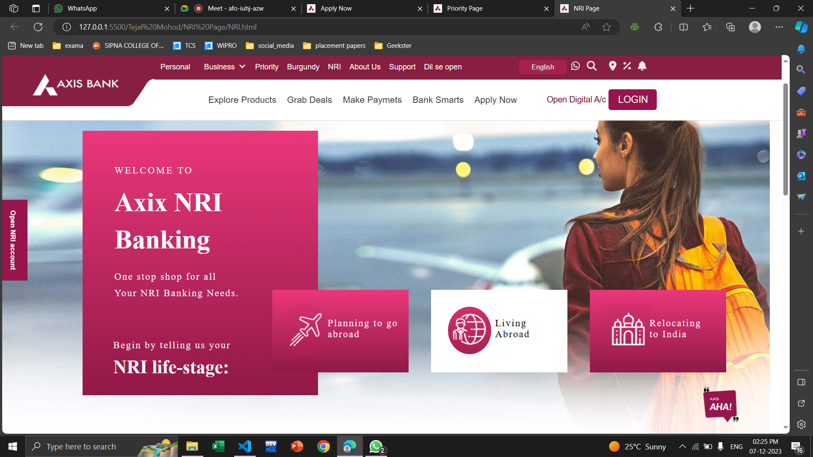
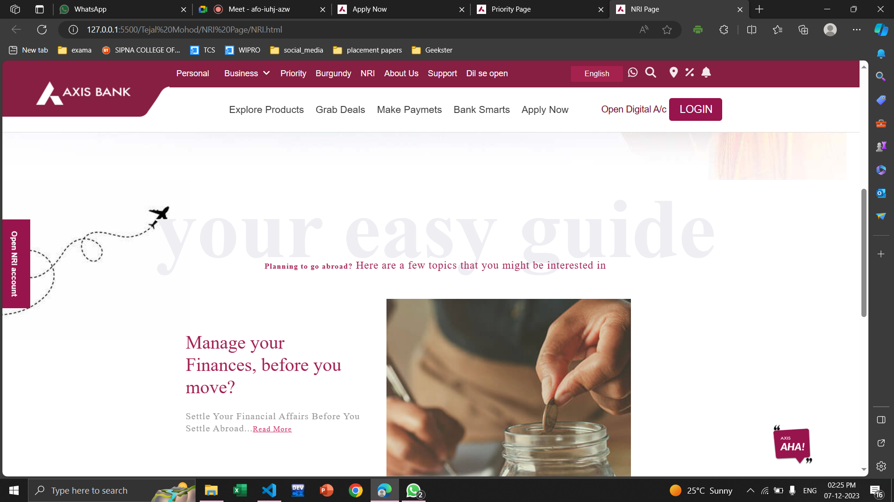
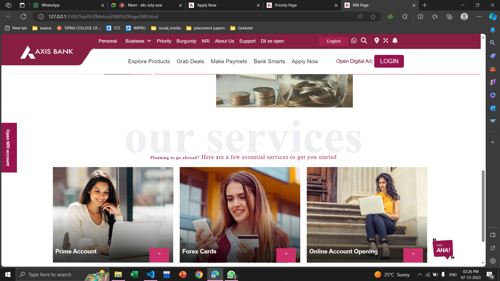
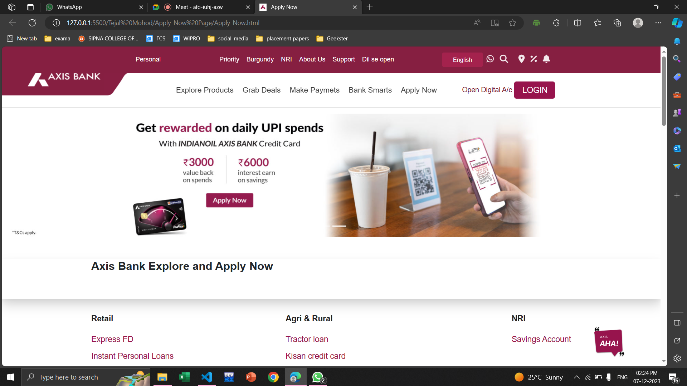
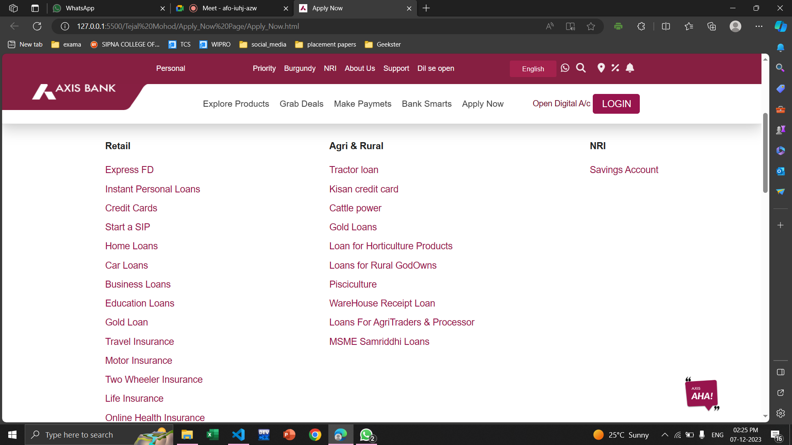

### Project name :

Axix Bank

## Tejal Mohod

My Name is Tejal Mohod , I am from fs15 batch , I got a Axix bank project ,where we have been assigned with a different task so

I am tasked with creating three essential pages for the Axis Bank UI project:  
an 'Apply Now' page, a 'Priority' page, and an 'NRI' page. The 'Apply Now' page involves designing an intuitive form for users to submit applications seamlessly. The 'Priority' page focuses on highlighting exclusive benefits for Priority customers, outlining the application process, and detailing membership perks. Finally, the 'NRI' page aims to provide NRIs with a comprehensive overview of banking services, account opening processes, currency exchange details, and dedicated customer support information. The goal is to deliver a user-friendly and visually appealing interface for each of these pages.

### Tags Used

Semantic Tags:

- header: Represents the header of the document or a section. 
- nav: Defines a container for navigation links. 
- main: Represents the main content of the document. 
- section: Defines a section of the document. 
- footer: Represents the footer of the document or a section. 
   
  Non-Semantic Tags: 

- div: A generic container used for grouping and applying styles to sections of content. 
- span: A generic inline container often used for applying styles to a specific portion of text. 
- a: Represents hyperlinks. 
- img: Embeds images. 
- p: Represents a paragraph of text. 
- ul, ol, li: Used for creating unordered and ordered lists. 

Form Tags : 

- <form>: Represents an HTML form for user input. 
- <input>: Represents an input control. 
- <label>: Represents a label for an <input>, <select>, <textarea>, etc. 
- <select>: Represents a drop-down list. 
- <button>: Represents a clickable button. 
  Other Tags : 

- <script>: Embeds or references JavaScript code. 

### External Packages/Frameworks Used 

- _Bootstrap:_ Our project incorporates the Bootstrap framework to streamline the development process, benefiting from its extensive collection of responsive components and styles. 

- _FontAwesome:_ We enriched our user interface by integrating FontAwesome icons, adding a visually appealing and consistent iconography to our project. 

- _Google Fonts:_ To enhance the typography and overall aesthetic, we integrated Google Fonts, ensuring a visually pleasing and readable text across the website. 

## First Page : 

Priority Page 

 

# description: 

Incorporating an interactive and visually engaging element into our UI project, we've seamlessly integrated the Bootstrap Carousel to power our dynamic slider. Leveraging the flexibility and robust features of Bootstrap, the Carousel component allows us to showcase key content, promotions, or featured products in an eye-catching and user-friendly manner. With a responsive design that adapts seamlessly to various screen sizes, the Bootstrap Carousel enhances the overall user experience, providing a polished and professional look to our web application. The carousel not only ensures smooth navigation through content but also brings a modern touch to our interface, making it an integral part of our strategy to create an aesthetically pleasing and interactive user interface.

 

#description: 

Incorporating the CSS Flex property has significantly streamlined our UI development. This powerful feature provides us with a straightforward and efficient way to organize and align elements within our layouts. By leveraging Flexbox, I've achieved a responsive design that seamlessly adjusts to diverse screen sizes. This not only enhances the visual appeal but also contributes to a more user-friendly and adaptable interface, ensuring a positive user experience across devices.
 

#description 

I have used flex property of CSS for best row wise division ,and border right property for adjsting the vertical line after each division.At the right Bottom i have used a chat Box for this is have use js it will giv us a alert messsege for which message which we have send.
 

## Second Page : 

NRI page 

 

#description: 

In the design of our page, we've employed a strategic combination of CSS techniques to enhance both aesthetics and functionality. Leveraging the position: absolute property, we've precisely positioned certain elements, ensuring a clean and organized layout. The flex property, on the other hand, has empowered us to create a flexible and responsive structure, seamlessly adapting to various screen sizes. To elevate the user experience, we've incorporated subtle animations, bringing a dynamic touch to key interactions and transitions. This thoughtful integration of position: absolute, flex, and animations collectively contributes to a visually engaging and user-friendly NRI page, aligning with our commitment to delivering a modern and polished interface.
 

 

#description: 

For creating this page i have use AOS Library which gives the proper animation on scrolling the perticular page.
 

 
#description: 
Incorporating the CSS Flex property has significantly streamlined our UI development. This powerful feature provides us with a straightforward and efficient way to organize and align elements within our layouts. By leveraging Flexbox, I've achieved a responsive design that seamlessly adjusts to diverse screen sizes. I ahve use AOS Library for best animation while scrolling the page.
 

## Third Page :

 
Apply Now Page
 

 
#description:
 
Incorporating an interactive and visually engaging element into our UI project, we've seamlessly integrated the Bootstrap Carousel to power our dynamic slider. Leveraging the flexibility and robust features of Bootstrap, the Carousel component allows us to showcase key content, promotions, or featured products in an eye-catching and user-friendly manner. With a responsive design that adapts seamlessly to various screen sizes, the Bootstrap Carousel enhances the overall user experience, providing a polished and professional look to our web application.
 

 
#description:
I have used flex property of CSS for best row wise division ,and border right property for adjsting the vertical line after each division.At the right Bottom i have used a chat Box for this is have use js it will giv us a alert messsege for which message which we have send.
 

## What I learned Form this project 

1.CSS Techniques: 
Master CSS techniques such as Flexbox, Grid, and responsive design principles. These play a crucial role in creating layouts that are visually appealing and adaptable.
 
2.Animation:  
Explore the use of animations to enhance user engagement. However, be mindful of using animations judiciously to avoid overwhelming users.
 
3.Positioning: 
Understand the intricacies of positioning elements using CSS. The position: absolute property can be powerful when used appropriately, but it's important to consider its impact on the overall layout.
 
4.Stay Updated:  
The field of UI/UX design and development is dynamic. Stay informed about the latest trends, tools, and best practices to continually improve your skills.
 
